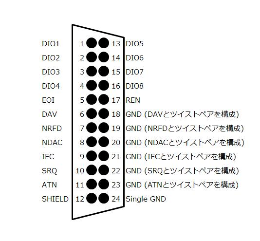
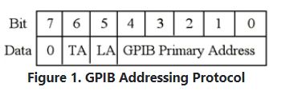
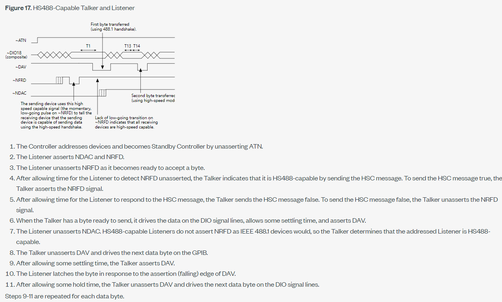
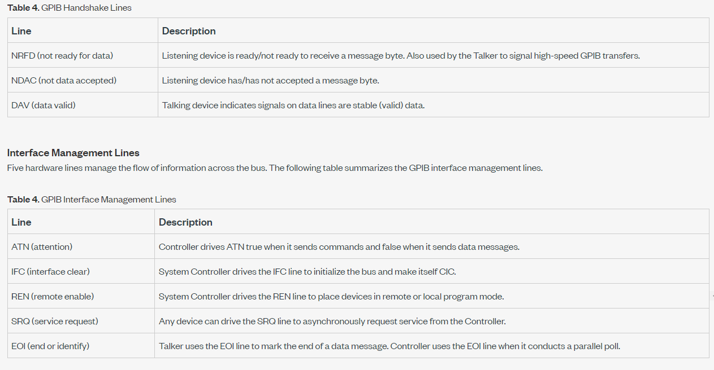
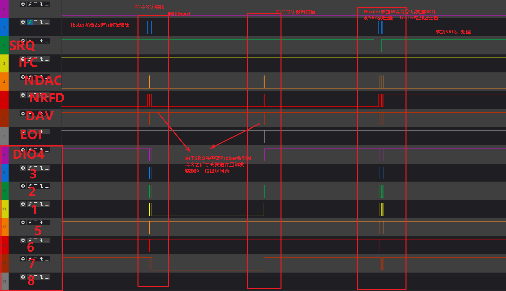
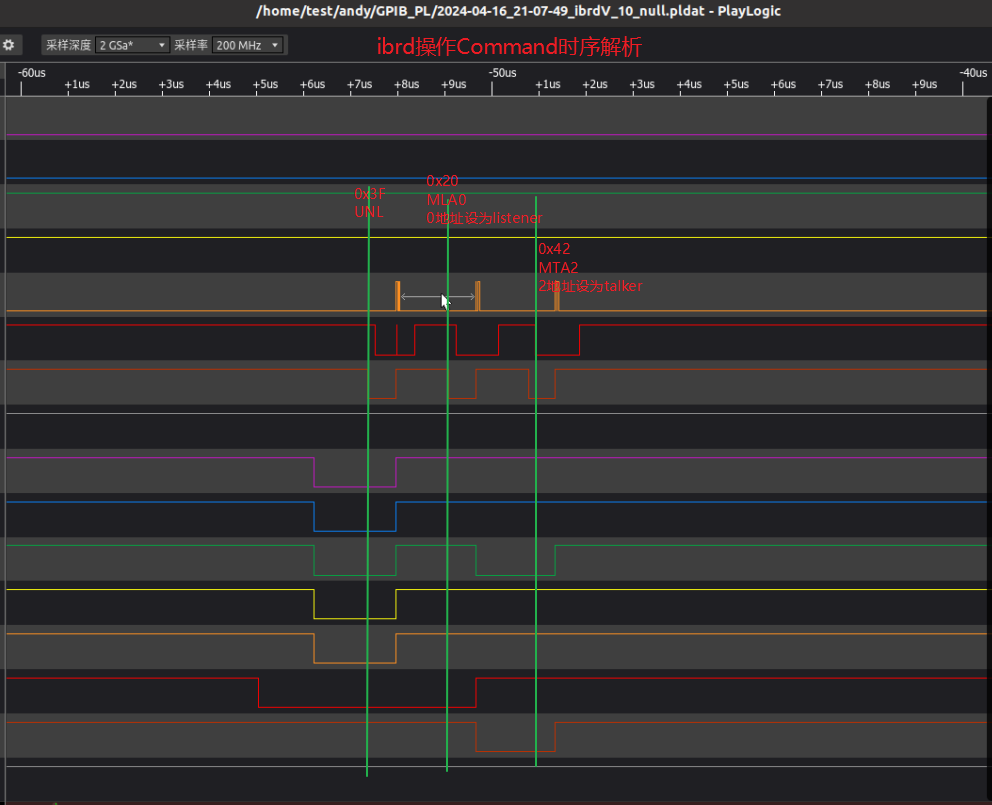
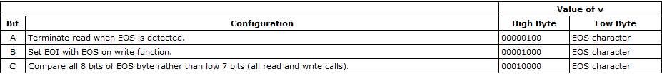

## 1 - IEEE488简介

​	**IEEE-488** 是一种由[惠普公司](https://zh.wikipedia.org/wiki/%E6%83%A0%E6%99%AE%E5%85%AC%E5%8F%B8)（现为[安捷伦科技](https://zh.wikipedia.org/wiki/%E5%AE%89%E6%8D%B7%E5%80%AB%E7%A7%91%E6%8A%80)及[是德科技](https://zh.wikipedia.org/wiki/%E6%98%AF%E5%BE%B7%E7%A7%91%E6%8A%80)）在1960年代开发的HP-IB（*Hewlett-Packard Interface Bus*，惠普接口总线）短程通信[总线](https://zh.wikipedia.org/wiki/%E6%80%BB%E7%BA%BF)规范。随后成为了标准，并通称为**GP-IB**（*General Purpose Interface Bus*，通用接口总线）。

##  2 - GPIB总线构成

#### 2.1 - GPIB接口示例图



#### 2.2 - GPIB总线说明

**Data Lines**

> The eight data lines, DIO1 through DIO8, carry both data and command messages. The state of the Attention (ATN) line determines whether the information is data or commands. All commands and most data use the 7-bit ASCII or ISO code set, in which case the eighth bit, DIO8, is either unused or used for parity.  

**Handshake Lines** 

> Three lines asynchronously control the transfer of message bytes between devices. The process is called a 3-wire interlocked handshake. It guarantees that message bytes on the data lines are sent and received without transmission error. 
>
> **NRFD (not ready for data)** - Indicates when a device is ready or not ready to receive a message byte. The line is driven by all devices when receiving commands, by Listeners when receiving data messages, and by the Talker when enabling the HS488 protocol.  
>
> **NDAC (not data accepted)** - Indicates when a device has or has not accepted a message byte. The line is driven by all devices when receiving commands, and by Listeners when receiving data messages.  
>
> **DAV (data valid)** - Tells when the signals on the data lines are stable (valid) and can beaccepted safely by devices. The Controller drives DAV when sending commands, and the Talker drives DAV when sending data messages.  

**Interface Management Lines** 

> Five lines manage the flow of information across the interface: 
>
> **ATN (attention)** - The Controller drives ATN true when it uses the data lines to send commands, and drives ATN false when a Talker can send data messages. 
>
> **IFC (interface clear)** - The System Controller drives the IFC line to initialize the bus and become CIC.  
>
> **REN (remote enable)** - The System Controller drives the REN line, which is used to place devices in remote or local program mode.  
>
> **SRQ (service request)** - Any device can drive the SRQ line to asynchronously request service from the Controller.  
>
> **EOI (end or identify)** - The EOI line has two purposes - The Talker uses the EOI line to mark the end of a message string, and the Controller uses the EOI line to tell devices to identify their response in a parallel poll.

## 3 - GPIB物理层

#### 3.1 - Controllers, Talkers, and Listeners

> - **Controllers** govern the flow of information on the bus by issuing Talker and Listener assignments to other devices on the bus. They respond to service requests from instruments, and they can pass control of the bus to other Controllers. There can be only one Controller-In-Charge (CIC or System Controller) per bus, which is responsible for overall management of the bus.
> - **Talkers** place information on the data lines of the bus, but only when a Controller instructs them to do so. Only one device can talk at a time.
> - **Listeners** retrieve information from the data lines of the bus, but only when a Controller instructs them to do so. Any number of devices can listen at the same time.

**注意：**

> Some devices are capable of playing more than one role. A digital voltmeter, for example, can be a Talker and a Listener. If your system has a National Instruments GPIB interface and software installed, it can function as a Talker, Listener, and Controller.

#### 3.2 - Command Messages vs. Data Messages

> GPIB Controllers use command messages to tell devices (instruments or other Controllers) when they can talk to provide information to the bus and when they can listen to information on the bus. The Talker and Listener assignments are sent as command messages, while the information is passed as data messages.
>
> The major difference between a command message and a data message is the state of the Attention (ATN) line, which is one of the bus management lines. If the ATN line is asserted, any messages sent on the data lines are heard by all devices, and they are understood to be command messages. If the ATN line is not asserted, only the devices that were addressed to listen may receive the messages on the data lines.  

#### 3.3 - The GPIB Addressing Protocol



> Bits 0 through 4 indicate the primary address of the device, for which the Talker/Listener assignment is intended. If bit 5 is high, the device should listen. If bit 6 is high, the device should talk. Bit 7 is a "don't care" bit. Its value is ignored, so it is interpreted as a value of zero in command messages.
>
> Each device on the bus must have a unique address. This address consists of a primary address (PAD) and a secondary address (SAD). As you can see from Figure 1, five of the data lines are used to indicate the GPIB primary address. This means that you could have a value from 0 to 31, for a total of 32 (2 to the power of 5) addresses; however, **PAD 31 is never used as a primary address**, because it is used for special command messages. This leaves a total of 31 possible primary addresses. The Controller-In-Charge (CIC) for a bus is almost always at PAD 0, so the instruments on a bus can have primary addresses from 1 to 30. A common mistake in working with the GPIB is assigning the same address to the controller board and the instrument, which will result in an EADR error (addressing error).
>
> The GPIB secondary address is identical in its range of 0 to 30, which allows for a total of 961 (31 x 31) possible GPIB addresses, but the secondary address is very rarely used (the SAD is typically set to zero). Talker/Listener assignments are part of the primary addressing information, so with PADs you use either bit 6 or bit 5 when you send a command message. This might prompt you to ask, "How do I send the SAD information?" For secondary addresses, you set both bits 6 and 5 high when you send a command message. If you need to communicate with a device that has a secondary address, you need to indicate its primary address first and then immediately indicate its secondary address.

```cpp
//
// Command codes
//
#define UNL  0x3f  // GPIB unlisten command
#define UNT  0x5f  // GPIB untalk command
#define GTL  0x01  // GPIB go to local
#define SDC  0x04  // GPIB selected device clear
#define PPC  0x05  // GPIB parallel poll configure
#define GET  0x08  // GPIB group execute trigger
#define TCT  0x09  // GPIB take control
#define LLO  0x11  // GPIB local lock out
#define DCL  0x14  // GPIB device clear
#define PPU  0x15  // GPIB parallel poll unconfigure
#define SPE  0x18  // GPIB serial poll enable
#define SPD  0x19  // GPIB serial poll disable
#define PPE  0x60  // GPIB parallel poll enable
#define PPD  0x70  // GPIB parallel poll disable
```


#### 3.4 - Handshake





#### 3.5 - Information transfer





```cpp
// 通信系统初始阶段
step 1 ： Controller send IFC 
			初始化GPIB信道，表明自己是Controller（controller in charge）
// 数据交互阶段
step 2 ： Controller unassert ATN
			表示当前数据线上传输的为控制命令
step 3 ： Controller send command
			控制器通过发送command来确定总线上的Talker与Listener
step 4 ： Listener assert NRFD NDAC
			接收方初始化自己状态，先表示自己未准备好
step 5 ： Listener unassert NRFD
			接收方表示自己准备好接受数据
step 6 ： Controller assert ATN
			表示当前数据线上传输的为数据信息
step 7 ： Talker send a Byte message
			发送方监听到接收方准备完成后，发送一字节的数据，ASCII形式（7bit）由8分DIO线发送
step 8 ： Talker assert DAV
			发送放通过DAV表示数据有效可以接受
step 9 ： Listener unassert NDAC
			接收方表示数据接受完毕
step 10 ： Talker unassert DAV
			发送方取消数据有效信号
......(重复step 6 ~ step 9)
// 交互结束阶段
step 11 ： Talker assert EOI
			发送方数据发送完毕后出发EOI信号表示数据发送完毕
			
```


## 4 - GPIB驱动层（NI驱动）

#### 4.1 - Status

```cpp
//
// GPIB status bit vector: global variable ibsta and wait mask
//
#define ERR   (1<<15)  // Error detected
#define TIMO  (1<<14)  // Timeout
#define END   (1<<13)  // EOI or EOS detected
#define SRQI  (1<<12)  // SRQ detected by CIC
#define RQS   (1<<11)  // Device needs service
#define CMPL  (1<<8)   // I/O completed
#define LOK   (1<<7)   // Local lockout state
#define REM   (1<<6)   // Remote state
#define CIC   (1<<5)   // Controller-in-Charge
#define ATN   (1<<4)   // Attention asserted
#define TACS  (1<<3)   // Talker active
#define LACS  (1<<2)   // Listener active
#define DTAS  (1<<1)   // Device trigger state
#define DCAS  (1<<0)   // Device clear state
```


#### 4.2 - Error

```cpp
//
// Error messages returned in global variable iberr
//
#define EDVR   0  // System error
#define ECIC   1  // Function requires GPIB board to be CIC
#define ENOL   2  // Write function detected no Listeners
#define EADR   3  // Interface board not addressed correctly
#define EARG   4  // Invalid argument to function call
#define ESAC   5  // Function requires GPIB board to be SAC
#define EABO   6  // I/O operation aborted
#define ENEB   7  // Non-existent interface board
#define EDMA   8  // Error performing DMA
#define EOIP  10  // I/O operation started before previous operation completed
#define ECAP  11  // No capability for intended operation
#define EFSO  12  // File system operation error
#define EBUS  14  // Command error during device call
#define ESTB  15  // Serial poll status byte lost
#define ESRQ  16  // SRQ remains asserted
#define ETAB  20  // The return buffer is full
#define ELCK  21  // Address or board is locked
#define EARM  22  // The ibnotify Callback failed to rearm
#define EHDL  23  // The input handle is invalid
#define EWIP  26  // Wait already in progress on input ud
#define ERST  27  // The event notification was cancelled due to a reset of the interface
#define EPWR  28  // The system or board has lost power or gone to standby
```


#### 4.3 - EOS&EOI

> GPIB data transfers are terminated either when the GPIB EOI line is asserted with the last byte of a transfer or when a preconfigured end-of-string (EOS) character is transmitted. By default, EOI is asserted with the last byte of writes and the EOS modes are disabled.

```cpp
//
// EOS mode bits
//
#define BIN   (1<<12)  // Eight bit compare
#define XEOS  (1<<11)  // Send END with EOS byte
#define REOS  (1<<10)  // Terminate read on EOS
```

> - **EOS comparison method**—This indicates whether the EOS byte  has seven or eight significant bits. For a 7-bit EOS byte, the eighth bit of the  EOS byte is ignored.  
> - **EOS write method**—If this is enabled, the GPIB EOI line is  automatically asserted when the EOS byte is written to the GPIB. If the buffer  passed into an  ibwrt call contains five occurrences of  the EOS byte, the EOI line is asserted as each of the five EOS bytes are written  to the GPIB. If an ibwrt buffer does not contain an  occurrence of the EOS byte, the EOI line is not asserted (unless the EOT mode is  enabled, in which case the EOI line is asserted with the last byte of the  write).  
> - **EOS read method**—If this is enabled, ibrd, ibrda, and ibrdf calls are terminated when the EOS byte is detected  on the GPIB, when the GPIB EOI line is asserted, or when the specified count is  reached. If the EOS read method is disabled, ibrd,  ibrda, and ibrdf calls  terminate only when the GPIB EOI line is asserted or the specified count has  been read. 




#### 4.4 - Timeout

```cpp
//
// Timeout values and meanings
//
#define TNONE    0   // Infinite timeout (disabled)
#define T10us    1   // Timeout of 10 us (ideal)
#define T30us    2   // Timeout of 30 us (ideal)
#define T100us   3   // Timeout of 100 us (ideal)
#define T300us   4   // Timeout of 300 us (ideal)
#define T1ms     5   // Timeout of 1 ms (ideal)
#define T3ms     6   // Timeout of 3 ms (ideal)
#define T10ms    7   // Timeout of 10 ms (ideal)
#define T30ms    8   // Timeout of 30 ms (ideal)
#define T100ms   9   // Timeout of 100 ms (ideal)
#define T300ms  10   // Timeout of 300 ms (ideal)
#define T1s     11   // Timeout of 1 s (ideal)
#define T3s     12   // Timeout of 3 s (ideal)
#define T10s    13   // Timeout of 10 s (ideal)
#define T30s    14   // Timeout of 30 s (ideal)
#define T100s   15   // Timeout of 100 s (ideal)
#define T300s   16   // Timeout of 300 s (ideal)
#define T1000s  17   // Timeout of 1000 s (ideal)
```

> The timeout period is used to select the maximum duration allowed for a synchronous I/O operation (for example, ibrd and ibwrt) or for an ibwait or ibnotify operation with TIMO in the wait mask. If the 
> operation does not complete before the timeout period elapses, the operation is aborted and TIMO is returned in Ibsta. The timeout values represent the minimum timeout period. The actual period could be longer

[GPIB Messages]: https://www.ni.com/en/support/documentation/supplemental/06/gpib-messages.html

