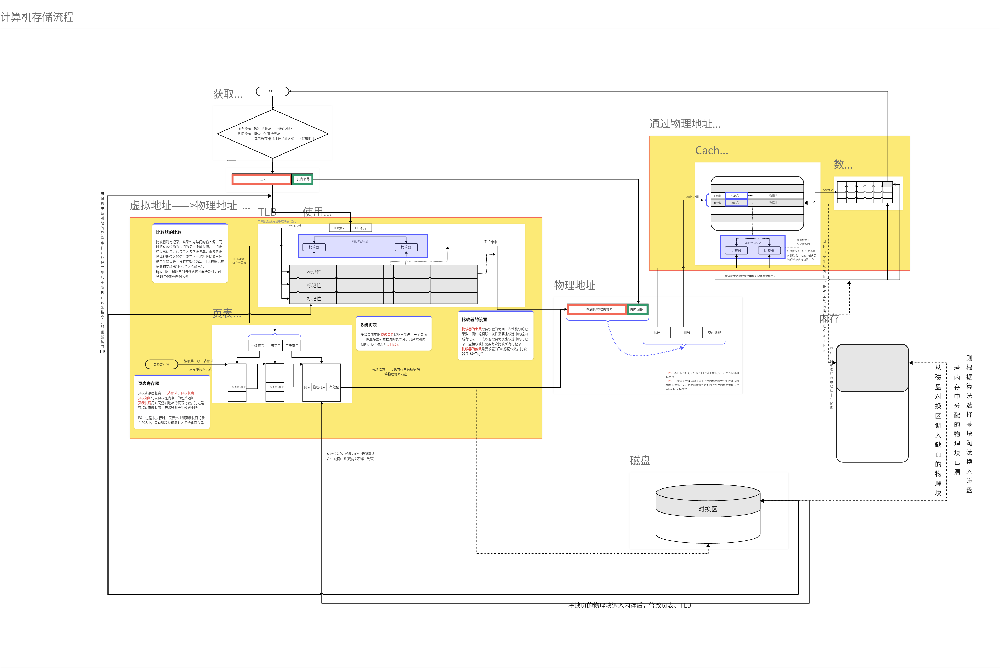
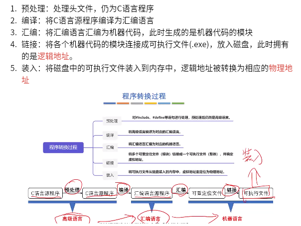
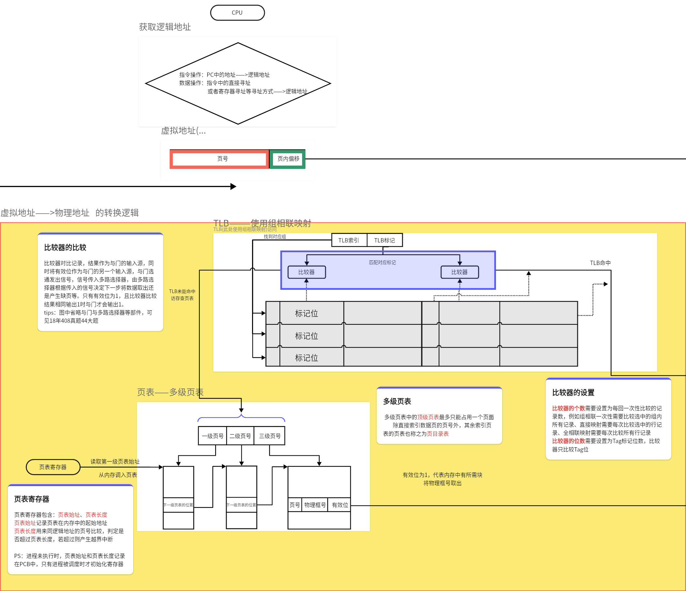

## 一、存储系统总览



## 二、内存

### 1 - 概念

​	内存（主存）为计算机进行活动过程中用来存储活动数据的空间，比如计算的数据，执行的指令等

### 2 - 内存构成

​	内存一般由DRAM芯片构成，DRAM芯片利用栅极电容存储信息，所以本质上存储的是电信号，同时栅极电容具有电容的特性，所以DRAM也存在刷新机制用于维护电信号。

​	DRAM只是一个存储芯片，那么我们现在常说的内存条又是个什么鬼呢？

​	一般来说，存储芯片所能容纳的数据量其实很有限，比如4K * 4bit（16 * 1024bit）数据量，也就是一个芯片可能只是以KB为单位的，而我们常说的内存条通常都是GB为单位，显而易见，内存条是存储芯片的集合，那么我们是怎么将一小个一小个的芯片组装成一整个内存条的呢？

​	我们简单以8GB的内存条为例，假设内存条的引脚为64个，也就是说内存条可以一次传递64bit的数据，但是一个4K*4bit的芯片一次只能传输4bit的数据，所以我们怎么读出64bit数据？

#### 2.1 - 字位扩展

​	显然，可以将16个存储芯片并排放在一起，16个芯片每个里面读出4bit，那么就读出了64bit，这种微观上读取多个芯片的位数从而达到宏观上的多位数据我们称之为 — **位扩展**。

​	ok，现在我将16个芯片并排放一起了，那么现在这16个芯片的容量也才16\*4K\*4bit = 32KB的容量，离我们8GB还差得远呢！我们有没有其他手段能够扩大容量呢？

​	有！除了增加我们位数，我们还可以从另一个角度开始。

​	8GB的内存条，我们一次读出来64bit，一共可以读1G次，也就是2^30次，也就是说我们以16个芯片为一组，那么拥有2^30组，所以我们可以考虑增加组数！我们将一次性读出来的64bit称之为字长，所以我们这种扩展方式称之为 — **字扩展**。

​	而这两种协同扩展空间构建8GB空间的方法就称为 — **字位同时扩展**。

​	补充思考一下存在的一个问题：

```
现在的情景是：
	我们需要将 4K * 4bit的存储芯片，构造成 1G * 64bit的内存条，进行位扩展后我们构造成了 4K * 64bit的存储组，我们说需要再进行字扩展才能构造1G * 64bit的内存条，现在我们进行字扩展，那么就需要1G / 4K = 256K个组，请问：硬件是如何确定我们读的是那个组呢？
    回答： 显然我们内存条数据线是64位，地址线为30位（表示有多少个组，显然有1G个，对应的就是30bit）。而我们构建出4K * 64bit有256K个，表示选择那个组需要18位，芯片内有4K个4bit，每个芯片中选中哪4个bit需要12bit，一共刚好30bit
```

> 更详细的物理构成参考：https://lzz5235.github.io/2015/04/21/memory.html

#### 2.2 - 内存刷新机制

​	经过上述的方案我们解决了如何用这一个个小的存储芯片构造成我们生活中用的存储条的问题，但是还存在一个问题：反过来想一下，我们使用的存储芯片是DRAM，为栅极电容存储方式，这种方式我们之前提到过是一种破坏性读出的存储方式，同时电容也是易失的，所以我们还要考虑维护数据，也就是我们常说的DRAM刷新机制保证原来的数据仍然存在。

​	那么通常有几种内存刷新机制如：

```cpp
// 注意： 刷新是以行为单位
集中刷新：专门腾出一块时间刷新所有行
分散刷新：每行读完立马就刷新
异步刷新：保证电容消散的时间中能够将每行都刷新完毕
```

​	ok，拥有了刷新机制，我们就保证了数据在内存中是时刻有效存在的，现在可以放心去操作了！但是麻烦还是存在！我们CPU的工作速度是相当之快的，但是内存条的工作速度却是有限的，现在你还搞出这个刷新，这下更慢了，难道我的CPU每次存取完下次来敲门的时候还得等你穿裤子吗？？？

#### 2.3 - 多模块存储器

​	根据上面的描述，我们总结一下当前的场景：

```
	现在一张8G（1G*64bit）的内存条，我们读取64bit后假设需要进行刷新恢复电容，我们将内存条从读出数据到刷新完数据进行下一次读取成为内存条的工作周期，1s中内存条工作多少次成为内存条的主频，同理CPU也有主频，随便参考一下市面上的cpu和内存条我们可以知道：
	酷睿i5 12490f的主频为 - 4.6GHz
	阿斯嘉特8GB内存条主频为 - 3200MHz（不考虑其他因素如DDR4）
	可以看出CPU的工作频率是高于内存条的工作频率，考虑极端情况CPU多次进行访存，那么这时候CPU是需要等待内存条存取数据并且进行刷新数据后再进行下一次读取操作，这时候就大大拖了CPU的工作效率。
```

​	那么我们有没有办法解决呢？

​	那必须是有的！

​	我们可以考虑再多加一张内存条，在这个内存条进行刷新的过程中，我们可以访问另一张内存条，听起来或许没有什么技术含量，但是这其中也有一些小问题：

```
	我们CPU进行地址访问的时候，可不管你是第几个内存条，我只管给出地址，我们怎么处理才能分散我们的访问次序呢？
    比如：我现在想要访问的次序是0x0001、0x0002、0x0003、0x0004，请问怎么处理？
    学过数学的很容易知道，我们将数字对2取余就可以将一堆数字交替分散称两堆，同理我们将地址对2取余就可以映射到两个内存条中，换而言之，我们将地址交叉编址完成交替访问，从而将多个存储器并行工作。
```

​	我们将上述方案的方式称为 — **低位交叉编址多体并行存储器**。

​	同时，提一嘴还存在一下两种模式：

```
单体多字：通过扩大字长扩大吞吐量
高位交叉编址：通过高位编址从而完成存储体的并行访问
```

> 此处可进一步参考：https://developer.aliyun.com/article/1150147

### 3 - 内存地址

​	由上可知，内存存储的是电信号，本质上就是正负信号（0/1），对应的就是bit位。在计算机系统中，通常使用字节作为单位用来存储8bit（1B = 8b）的数据，当我们对每个字节进行编址就得到了整个内存的地址大小。内存地址也即**物理地址**，好比房间和房间号。

​	研究一个问题：假设现在只有一个4GB的内存条，也就是物理内存只能访问到0x0000 ~0xFFFF地址大小，但是如果我的程序很大，比如占用了8个G（模型渲染、机器学习等），但是物理空间只有4GB大小，也就是说我8G的空间，只有4G的门牌号，剩余4G的空间系统里都查不到，这肯定是不合适的，但是我们可以很容易想到一个方法 — 拓展内存大小：

​	我们给我们的主机加上内存条，拓展到8G大小这样不就行了吗？

​	但是有两个缺点：1、贵

​				       2、缓兵之计，要是下一次10G怎么办？

​	有的人又会问，硬盘不贵，同等空间硬盘便宜多了，但是硬盘便宜的代价就是硬盘很慢，所以cpu不会直接同硬盘进行数据交互，cpu宝贵的资源超快的速度不可能每次都等待硬盘进行数据传输，所以我们需要的是一个机制—一个从根本上解决程序地址和物理地址不匹配的机制，那既然程序地址无法同物理地址一一对应，那么我们就可以将耦合解开来，采用别的方式完成程序地址到物理地址的转换，此处转换也即映射，此处程序地址就是我们要谈论的**虚拟地址**。

### 4 - 内存数据获取方式

​	既然有了存放数据的空间，也知道这些空间的编号，那么我们获取数据的方式无非就是按照编号找到对应的空间，然后取出对应的数据。而编号就是我们的物理地址，找数据的过程就是对应选片读取的过程。

​	如果现在编址空间为24bit表示大小，也就是0x000000~0xFFFFFF大小，如果我们将内存看作为一个矩阵空间（实际DRAM就是），每一行使用12bit容纳的空间，也就是每一行存储2^12（4096）B的数据，那么剩余12bit就成为了行号，此时我们就可称这24bit中，高12bit为行号，低12bit为列号，也称前者为行地址，后者为列地址。

​	同时为了节省资源，现代计算机通常使用行列地址复用技术减少地址线的根数。那么此处实际上我们只需要12跟地址线就足以，当我们想要获取某一个单元的数据的时候，我们通常会选择先传送12bit的行地址进行行选通，再传送12bit列地址进行列选通从而完成寻址，随后将数据读出通过数据线传送到CPU中。

​	

## 三、虚拟内存

### 1 - 引言

​	我们知道，程序员写代码的时候不需要关心物理地址，访问都是通过指针或者索引或者其他形式去访问，既然底层是通过地址去获取存储单元中的数据，那么这一环节是如何转换的呢？

​	以c为例，我们c代码是高级语言，代码执行过程可以有以下的执行过程：



​	

```cpp
#include <...>  // 预处理阶段处理

代码段  // 编译 -》 汇编 -》 链接 形成基于整个程序空间的逻辑地址

```

​	ok，现在我们经过了预处理、编译、汇编、链接从而形成了可执行程序，并且整个可执行程序中的数据或者指令也都被我们进行了编址，也就是拥有了基于程序这个空间的地址，那么为什么要进行装入操作呢？直接将可执行程序上CPU运行不就完事了吗？

​	其实，在以前的单道处理系统中是这样的，但是考虑效率现在的多道批处理系统中并非如此，现在的cpu是属于并发（甚至并行）执行多个程序，也就是说多个程序可能都要存储在内存中，那么小程序还行，如果是大程序怎么在有限的内存中进行操作呢？

### 2 - 虚拟地址

​	上文说到我们需要采用一种机制，解决物理地址有限的问题，我们称之为虚拟地址（逻辑地址）。物理地址受限于物理引脚的个数，物理引脚的个数确定了物理上能访问的空间大小，而虚拟地址则受限于os系统的架构，例如32位x86架构能够访问的空间大小和64位的x64架构能访问的空间大小则完全不同。

​	以32位x86架构的系统为例，我们虚拟地址以32bit进行编制，那么我们能够访问的空间的大小就是0x00000000 ~0xFFFFFFFF地址范围，我们说为什么受限呢？可以想想，我们现在写好了程序，编译、汇编、链接这些操作都是在哪里进行处理的？ 那必须是os中处理，所以我们被人家改造成了人家的位数，合情合理。

​	ok，现在我们的访问地址变大了，在程序的角度能访问的所有的房间都有门牌号了，但是实际的存储范围其实就那么大，我们上文中提到的解决方式是将虚拟地址与逻辑地址之间一一对应的关系改造为虚拟地址到物理地址之间映射的关系从而达到扩大程序地址空间的目的，那么接下来详细谈谈这个映射机制，从**虚拟内存**开始说起。

### 3 - 虚拟内存

​	我们说，物理地址空间能访问的空间大小称之为物理内存。那么逻辑地址（虚拟地址）能访问的空间大小则称之为虚拟内存。

​	接下来我们考虑一个问题：

```
我们之前谈到数据是以二进制存储在内存中，也就是数据是bit位；同时我们谈到内存中对数据编址是通过字节的形式，也就是B字节；
​	请问：我们程序运行过程中从内存中获取数据是以bit还是B为单位获取？
​	答案：我们地址是按照B为单位进行编址，自然我们也是以B位单位获取数据
```

​	再考虑一个问题：

```
假设现在有以下的情景：
	逻辑地址空间32bit，物理地址空间24bit；
​	请问：我们需要将32bit的空间大小映射到24bit空间中，应该怎么做？
​	答案：使用一个表，记录下来逻辑地址到物理地址之间的对应关系，拿到逻辑地址的时候查表获取对应的物理地址从而获取对应的数据。
```

#### 	3.1 - 页表

​	用于记录逻辑地址到物理地址之间的映射关系，页表存放在内存中。

​	思考：

```
还是以上的情景：
	逻辑地址空间32bit，物理地址空间24bit；
​	请问：现在有一个int类型的数据，请问怎么访问获取这个int类型的数据呢（不考虑大端小端等，只说明大致过程）？
​	答案：int类型的数据占用4个字节，也就是要获取连续的4个地址中保存的bit数据，所以我们需要根据将连续的4个逻辑地址通过查找页表来获取对应4个地址的物理地址，从而在物理内存中获取真实的物理数据。

	我们可以发现，再此过程中进行了4次地址转换，获得了4个物理地址，从而获取到了对应的4个B的数据。但是这个过程中存在一个问题，就是页表中也存在4条逻辑地址到物理地址的映射记录，ok，可能4条映射表现出来的问题不够明显，现在考虑我们想要获取如果是1MB的数据，那么映射记录就变成了1M个；如果是1GB数据，那么映射记录就变成了1G个；同时可以计算：
	逻辑地址32bit=4B，物理地址24bit=3B；
	那么
        1M个记录 = 1M*7B = 7MB；
        1G个记录 = 1G*7B = 7GB；
        可以看出页表占用的内存大小是相当大的。
	所以我们需要规避这种空间损耗，那么就必须增大映射的单位大小，换句话说就是将原来以B为单位映射改为以一堆B为单位进行映射，所以页表是以页为单位进行映射的。
	
	现在我们重新以页的方式进行映射，假设页的大小为1KB，那么此时1MB个数据就缩减为了1K个记录！
```

#### 3.2 - 段表

​	用于记录逻辑地址到物理地址之间的映射关系，段表存放在内存中。

​	同上，我们还存在一种映射方式是以段为单位进行映射，也就是表中存储的是段的逻辑地址到物理地址之间的映射关系，我们将在下一小节中说明这些差别。

#### 	3.3 - 页、段、页框

​	上文分析，为了避免不必要的浪费，我们引入了**页**这个概念，用来将一个B之间的映射转换为一堆B之间的映射；

​	那么**段**存在的意义就是将一堆B之间的映射进一步提升为一个模块之间的映射。

​	例如，现在有两个函数：

```cpp
void func1(){
    ...
}

void func2(){
    ...
}
```

​	那么在os层面，这两个模块照样会经过编译、汇编、链接成为二进制机器语言，那么为了保证函数的完整性，我们提出将func1作为一个段，将func2作为一个段。但是我们知道函数编译出来的产物通常是指令，而不是每个函数的指令长度都是一样的，也就是段的长度受实际代码复杂度等因素影响，所以在段表中我们是需要记录段的长度。

​	在虚拟内存层面我们交换的单位称之为**页**或者**段**，那么物理内存层面我们与之对应的单位也有名字，成为**页框**。

#### 3.4 - 虚拟地址（以页为例）

​	在引入了页这个概念后，我们的逻辑（虚拟）地址就可以划分为以下的形式

```
逻辑地址 = 逻辑地址剩余位数 + 页占用的位数

同时，我们进一步将名称规范一下，逻辑地址剩余位数表示的其实就是对页进行编址，所以称之为页号，表示是第几个页；
也占用的位数其实就是一个页中的第几个字节（因为毕竟总的来说是按照字节编址的），所以可以成为块内偏移；那么我们可以进一步写为:

逻辑地址 = 页号 + 块内偏移地址
```

​	思考：

```
依旧是上述的情景：
	逻辑地址32bit，物理地址24bit，页的大小为1KB
	逻辑地址 = 22bit页号 + 10bit页内偏移地址
按照这个逻辑，我们需要记录22bit也就是4M个页的映射记录在页表中，也就是页表的大小为：
	4M * （22 +14）bit = 4M * 36bit = 18MB
这是个不小的数字，同时伴随着地址空间的增大，这个数字还会增大，如果使用单级页表需要耗费巨大的连续空间，os对于这种空间的管理需要一定的消耗，而且考虑到并不是所有页都会被使用，所以还会造成大量的空间浪费。
	因此引入了多级页表的机制用于减少损耗，提高效率。假设现在使用的是两级页表，那么逻辑地址就可变成：
	逻辑地址 = 11bit一级页号 + 11bit二级页号 + 10bit块内（页内）偏移
```

​	ok，上文提到页表是存储在内存中的，同时我们的页号需要在页表中进行查找，那么我们怎么找到页表呢？

答案是--**页表始址寄存器**

​	页表始址寄存器会记录页表在内存中的起始地址，从而找到页表。页表始址寄存器中的值需要程序上cpu处理初始化上下文环境由进程PCB中获得初始化寄存器中的值。

​	所以我们具体查找流程如下：

```cpp
// 单级页表
step1： 获得逻辑地址
step2： 根据逻辑地址获得页号
step3： 根据页号和页表始址寄存器中页表起始地址去内存查找页表
step4： 根据页表中的记录获取对应的物理页框号
step5： 根据物理页框号找到内存中对应的页
step6： 根据页内偏移地址找到页中指定位置的字节

// 多级页表（二级为例）
step1： 获得逻辑地址
step2： 根据逻辑地址获得页号
step3： 根据一级页号和页表始址寄存器中页表起始地址去匹配获得二级页表地址
step4： 根据二级页号在二级页表中匹配真正记录页号到页框号映射的页表
step5： 根据页表中的记录获取对应的物理页框号
step6： 根据物理页框号找到内存中对应的页
step7： 根据页内偏移地址找到页中指定位置的字节

// 注意：页表中并不需要逐个比对，由于顺序一致，所以
页表项地址 = 页表基址 + 页表项大小 × 页号
```

​	ok，那现在我们可以从上述流程发现（单级页表为例），我们地址转换一共进行了两次访存（访问内存）：

```
第一次：去内存查找页表获得物理地址
第二次：去内存获取数据
```

​	同时我们知道，cpu和内存的效率差距很大，所以每一次访存都是一次很大的损耗，那么有没有办法能够提高效率呢？

​	答案肯定是有的，现在计算机系统集成了一套机制--TLB机制，也称之为快表，相对应的就把内存中的页表称之为慢表。

#### 3.5 - 局部性原理

​	谈论快表之前，谈论一下在计算机设计中广泛用到（包括下文的cache系统）的局部性原理；

```
时间局部性（Temporal Locality）:

时间局部性指的是程序在某一时刻访问了某个存储位置后，短时间内可能会再次访问该位置。例如，循环中的变量或频繁使用的子程序都有很高的时间局部性。
例子: 在一个循环中，多次访问相同的变量或数组元素。每次循环迭代时，程序都会访问同一个存储位置。

空间局部性（Spatial Locality）:

空间局部性指的是程序在访问某个存储位置时，它附近的存储位置在不久的将来也可能会被访问。这意味着，如果一个存储位置被访问了，存储器中相邻的位置很可能也会被访问。
例子: 在访问数组中的一个元素后，程序很可能会访问相邻的元素。
```

#### 3.6 - 快表（TLB）

​	快表其实本质上是一个页表的缓存，采用的是相联存储器（硬件），集成在CPU中，速度很快。映入快表后，查找流程就转变为：

```cpp
// 单级页表
step1： 获得逻辑地址
step2： 根据逻辑地址获得页号
step3： 根据页号查找快表，若查找到对应物理页框号直接跳转step5
step4： 根据页号和页表始址寄存器中页表起始地址去内存查找页表
step5： 根据页表中的记录获取对应的物理页框号
step6： 根据物理页框号找到内存中对应的页
step7： 根据页内偏移地址找到页中指定位置的字节
```

#### 3.7 - 小结

​	程序编译为可执行程序(二进制文件—ELF文件)；

​	CPU调度进程上处理机运行，同时从PCB中获取信息初始化上下文（包括页表始址寄存器等);

​	取指执行阶段，访存获取指令；

​	查找快表；

​	查找页表；

​	访问内存；

**注意：**这其中还包括查找不命中的情况，并非如此简单顺利，后续有时间再补充！

​	至此，这一部分就完结了！



## 四、cache缓存

### 1 - 引言

​	我们说物理内存是采用DRAM（动态随机存储器）构成，与CPU之间仍有效率差距，为了提高效率，同时践行局部性原理，引入内存的缓存机制-cache机制。

​	cache采用SRAM（静态随机存储器）构成，比DRAM更快（同时也更贵）。

​	cache作为内存的缓存，会保存部分内存的数据为了保证更快的访问，那么既然是保存部分数据，自然就涉及到以下的问题：

```
1. 数据以什么形式保存在cache中
2. 数据调入的方法
3. 如何保证cache和主存数据的一致性
4. 效率问题
```

​	下面将会对这些问题一一解答。

​	同时上述的虚拟内存、逻辑地址体系完成了逻辑地址到物理地址的转换，现在我们终于拥有了物理地址，开始访问存储器......

### 2 - 数据以什么形式保存在cache中

​	既然作为内存的副本（缓存），那首先必要的就肯定是**内存中的数据**。

​	那是不是只存储数据就ok了呢，我们从前往后推理一下即可：

```
假设现在cache中只有内存中的数据：
	CPU现在访问的地址为0xfffff1，同时我们假设主存中该地址对应的数据已经把副本放在了cache中，请问CPU去缓存中该如何找到想要的数据呢？
	你也许懂了，哦~原来我访问存储器一直都是按照内存地址访问的，现在访问cache并没有对应的物理地址，所以我们得重新加上物理地址，但是cache既然只保存一部分内存中的数据，我难道得重新给cache进行编址吗？
```

​	显然，上述的推理是合理的。

​	但是，没有必要！因为我们cache是SRAM存储单元构建，该单元的存储速度很快并且存储的数据量也没有内存中那么多，所以没有必要将访问内存的地址线访问存储空间不大的cache，同时减少了资源的浪费。

​	cache采用的是另一套匹配逻辑 — **标签**。

​	同上述虚拟地址与物理地址之间映射的逻辑，我们cache与主存之间的数据交换仍然采用的是一堆字节之间的交换，在主存中我们称为数据块，在cache中我们称为cache行。

​	我们将一个主存块挪到cache行中，需要对这个cache行进行标记，表示对应的是哪一个主存块：

```
采用逻辑地址访问cache，由于cache行保存的是主存块的副本，所以caache行内的地址等于主存块中的地址。剩下的就是保存主存块到cache行中的映射关系
	直接映射：
	全相联映射：
	组相联映射：
```

### 3 - 数据调入的方法

### 4 - 如何保证cache和主存数据的一致性

### 5 - 效率问题

## 五、磁盘